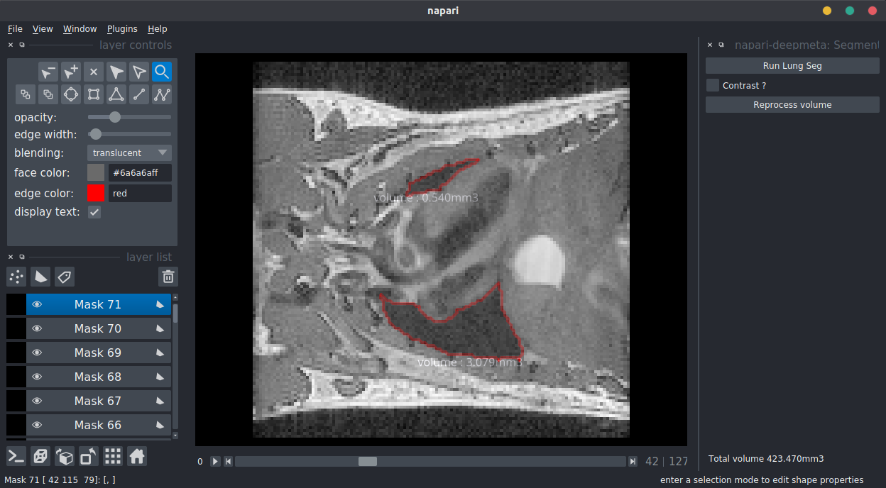
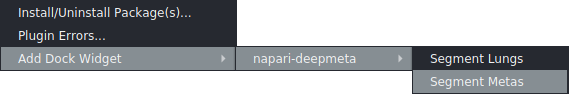
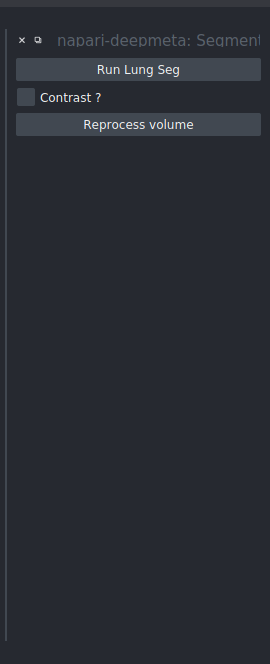
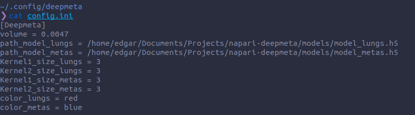

Welcome to napari-deepmeta's documentation!
===============================================================

This plugin is a demo for the `Deepmeta project <https://github.com/EdgarLefevre/DeepMeta>`_.

It aims to segment lungs and metastasis in MRI images of mice.

On this screenshot, you can see the output of our neural network (nested u-net) draw on the mouse image (red contours).

Installation
------------

You can install `napari-deepmeta` via [pip]:

.. code-block:: bash

    pip install napari-deepmeta

Usage
------

Open a (x, 128, 128) image, go in the plugin menu, add deepmeta plugin to the dock viewer and click on the button.

By adding the dock widget, a menu will be created on the left of your Napari instance.

In this panel you will find two buttons and one checkbox:

+ The first button *Run lung seg* process segmentation and show the result (With the widget segment metas, the button is called *Run meta seg*).
+ The second, *Reprocess Volume*, is useful when you modify contours. It will reprocess all slices to give you a new volume.
+ The checkbox is here to enhance contrast if your image is dark.

Conf file and custom models
----------------------------

The first time you run the plugin a config file will be created at *~/.config/deepmeta/config.ini*.

In this file you can find parameters for postprocessing loop and the path for the models.
Feel free to change values and colors to fit to your needs.

.. warning::
    If you want to try another model, you can change the path. Be careful to not having custom objects in you model, otherwise, you'll have to modify the code.

.. automodule:: deepmeta.deepmeta_functions
    :members:
    :member-order: bysource

Indices and tables
==================

* :ref:`genindex`
* :ref:`modindex`
* :ref:`search`

